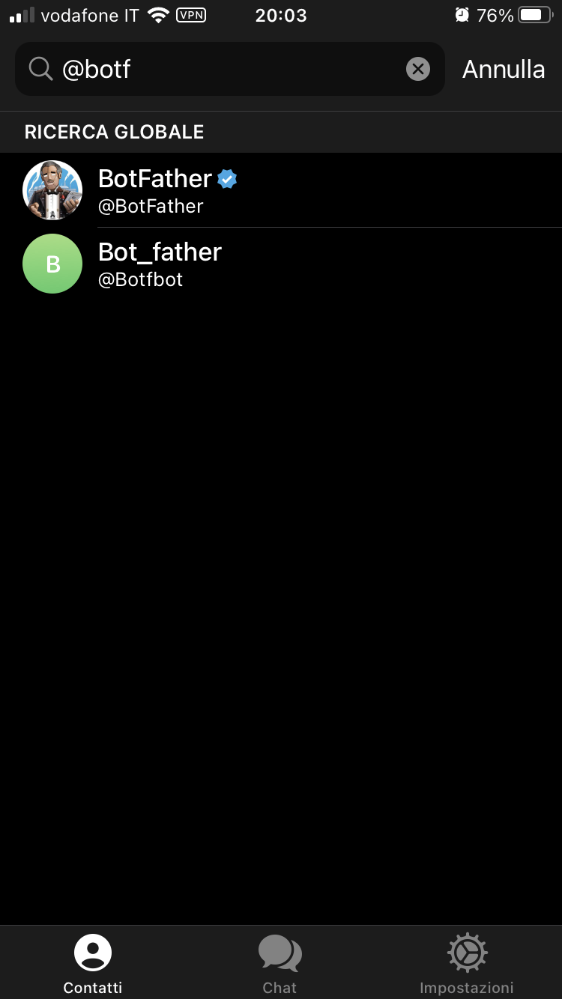
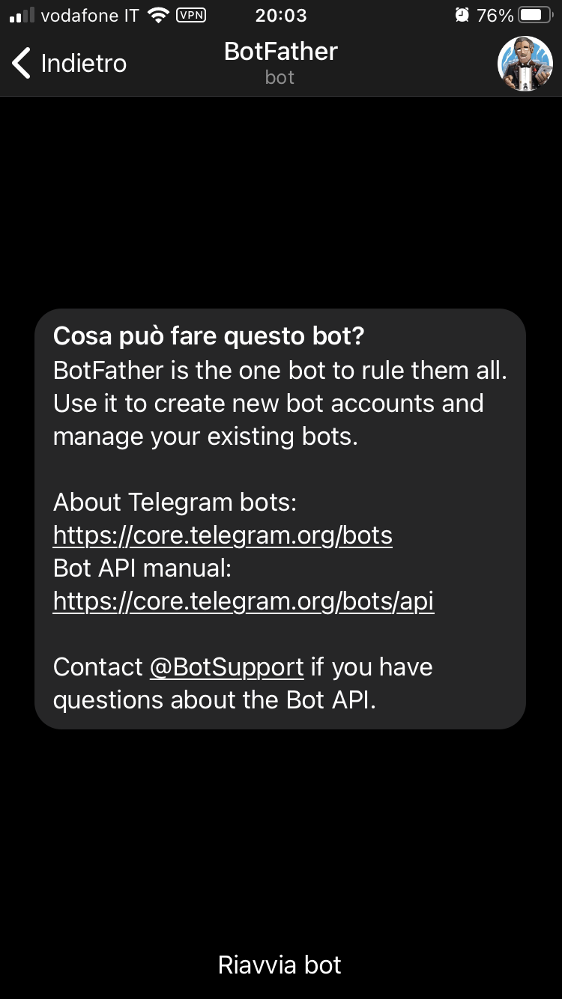
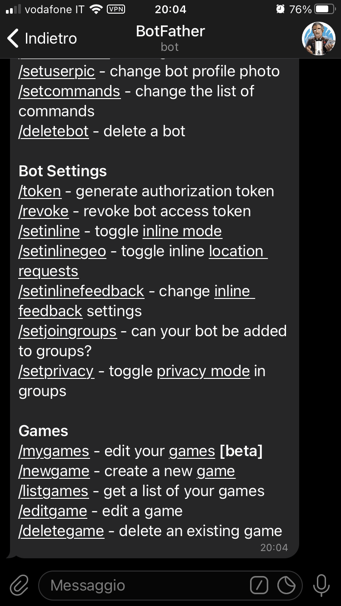
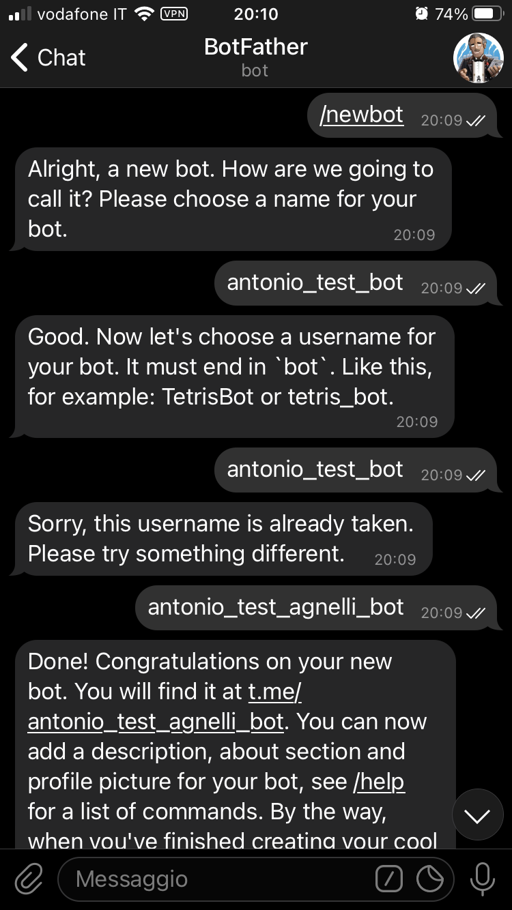
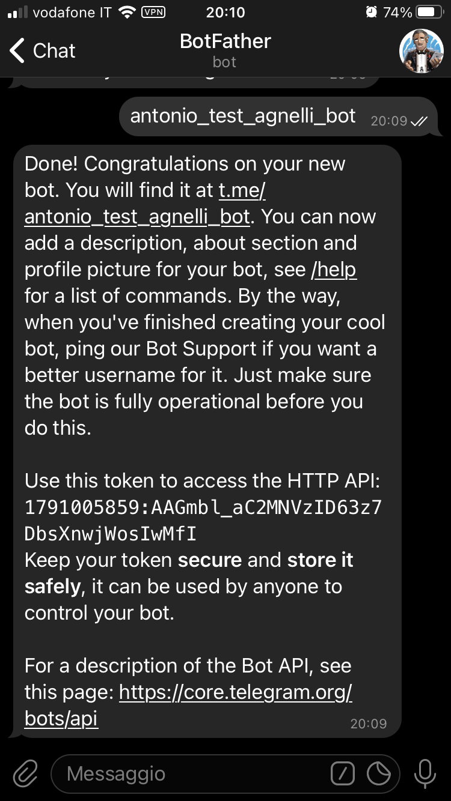

# Telegram Bot

Un *bot* Telegram è un'applicazione di terze parti che è vista come un utente Telegram.


In altre parole, un bot, è uno speciale account Telegram che non richiede un numero di telefono e che permette di implementare un'applicazione arbitraria fornita dall'utente e non da Telegram.

Gli utenti possono interagire con il bot inviando **messaggi** e **comandi** al bot stesso, che sono processati e gestiti dal codice utente che implementa il bot.

# Bot in JavaScript

Per realizzare un bot in JS, sono necessari due elementi fondamentali:

1. un server nodejs
2. una libreria per interagire con le API di Telegram

## nodejs

**nodejs** è presente in tutti i moderni packet manager delle varie distribuzioni di Linux e su choco su Windows.

Per installare nodejs far riferimento al manuale del packet manager utilizzato.

Per le distribuzioni debian-based, al fine di essere sicuri di installare l'ultima versione di node, aggiungere il file `nodesource.list` in `/etc/apt/sources.list.d/`

```
deb [signed-by=/usr/share/keyrings/nodesource.gpg] https://deb.nodesource.com/node_16.x focal main
deb-src [signed-by=/usr/share/keyrings/nodesource.gpg] https://deb.nodesource.com/node_16.x focal main
```

Per le distribuzioni Linux debian based, eseguire:

```
sudo apt install nodejs
```

## Librerie Telegram

Telegram espone un API HTTP molto varia e completa per interagire con la piattaforma e con il bot.

Normalmente, quando si programma un bot, si utilizza una libreria che implementa tali librerie fornendo un'interfaccia coerente con il linguaggio scelto.

Esistono moltissime librerie per i vari linguaggi. Questo [link](https://core.telegram.org/bots/samples#node-js) fornisce una lista completa di tali librerie.

Per nodejs esistono 7 librerie principali. Una delle più complete è **telegraf**, ma anche altre librerie sono molto buone ed altrettanto valide.

### Installare telegraf

Per installare telegraf, utilizziamo il packet manager di nodejs chiamato **npm**.

Basta eseguire il seguente comando

```
npm install telegraf
```

Questo installerà la libreria telegraf nella directory corrente.

Per far si che la libreria sia correttamente caricata da nodejs, modificare il file *package.json* in modo che contenga la linea

```
"type": "module"
```

Il file deve essere simile a questo:

```
{
  "dependencies": {
    "telegraf": "^4.3.0"
  },
  "type": "module"
}
```

# Sample Bot

Il file *sample_bot.js* contuiene l'implementazione di un bot d'esempio scritto in JS che usa la libreria telegraf.

## BotFather

Per creare un nuovo bot è necessario farne richiesta al **BotFather** che è il capostipite di tutti i bot. Il BotFather è un bot fornito e gestito da Telegram.

### Ricerca BotFather

Ricerca il BotFather nella lista dei contatti dall'applicazione telegram




### Riavvia BotFather

Premi su riavvia per far partire il collegamento a BotFather



Una volta collagati il BotFather visualizza una schermata in cui sono contenuti tutti i comandi disponibili.



### Creare un nuovo bot

tramite il comando `/newbot ` si inizia la procedura di creazione di un nuovo bot.

Bisogna fornire il nome del bot (il nome deve esser eunivoco) e il nome di uno username per il bot (anche questo deve essere univoco e deve finire con **bot**)



### BOT TOKEN

Una volta che la creazione del bot è completata, BotFather visualizza un messaggio di conferma.

L'informazione più importante in questo messaggio è il TOKEN del BOT che è fondamentale per programmare il bot in JS.



*Come scritto dal BotFather è importante mantenere al sicuro il TOKEN, in quanto chiunque è in possesso del TOKEN ha il controllo sul tuo bot*

### Avviare il bot

Per avviare il bot eseguire il seguente comando:

```
node sample_bot.js
```
